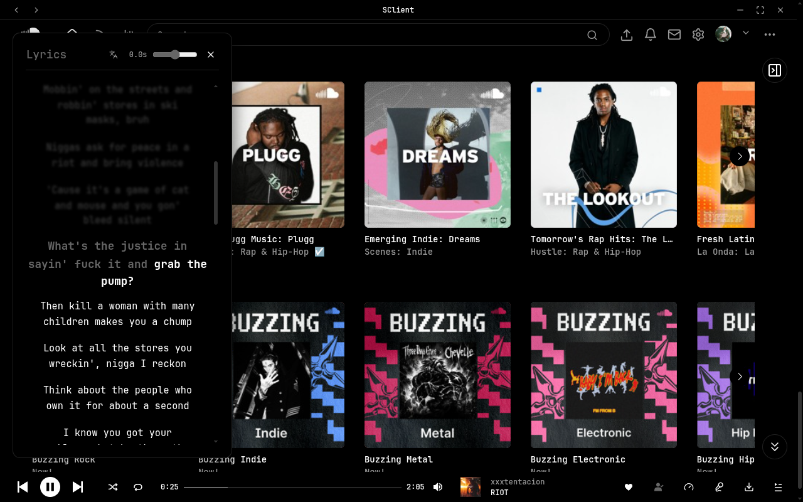
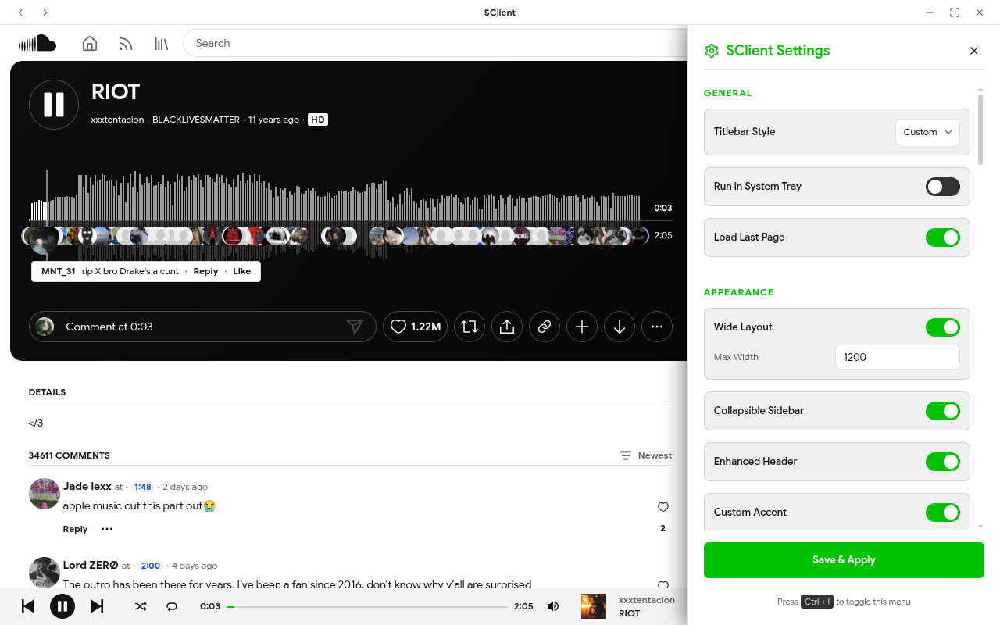
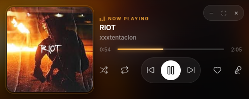
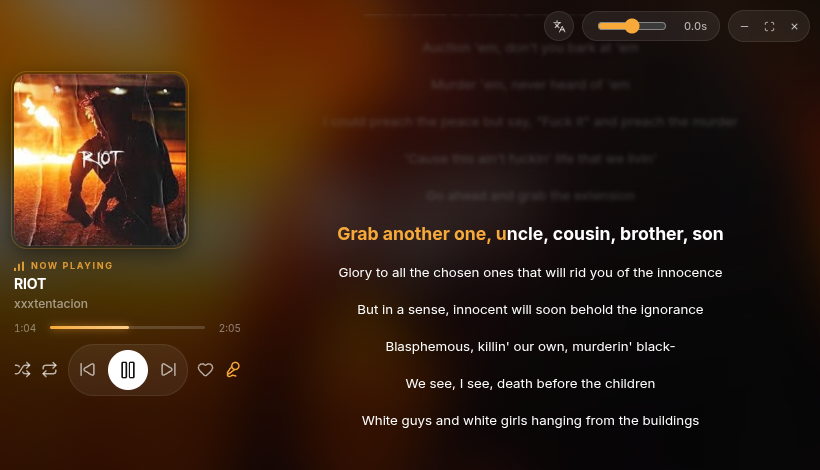

# SClient

Customizable cross-platform desktop client for SoundCloud

<p align="center">
  
  
</p>

<p align="center">
  
  
</p>

## Features

- **Zero Telemetry & Adblocker:** Collects no data; blocks ads, trackers, and telemetry natively (via Ghostery)
- **DRM Support:** DRM-protected tracks work out of the box using proper Widevine DRM (Castlabs Electron on Linux and Windows)
- **Region Bypass:** Built-in proxy support to bypass geographic track restrictions (use the public proxy in-app or self-host `src/api/index.js`)
- **Audio & Playback:** Real-time playback speed, pitch shifting, and reverb effects; true shuffle (pre-loads playlist / API-level shuffle)
- **Integrations:** Synced romanized lyrics (via `lrcmux.dev`), Last.fm and ListenBrainz scrobbling (encrypted via Electron `safeStorage`), Discord Rich Presence, and track/playlist downloader via `youtube-dl`
- **Customization & UI:** Compact mini-player with lyrics and audio visualizer, live custom CSS/JS editor, layout/theme customization, multi-account profile manager, and system tray background support
- **Playlist Manager & Stats:** Dedicated overlay to import, export (Exportify `.csv` support), and re-order playlists; local listening history and stats analytics

## Installation

Download the latest release for your OS from the [Releases](https://github.com/vzpyr/sclient/releases) page:

- **Linux:** `.deb`, `.rpm`, `.AppImage`, `.flatpak`
- **Windows:** `.exe` (Setup), `.exe` (Portable)

## Building from Source

### Prerequisites

- Node.js 18+ and npm

### Desktop (Linux, Windows)

```bash
git clone https://github.com/vzpyr/sclient.git
cd sclient
npm install
```

Linux:

```bash
npm run build:linux
```

Windows:

```bash
npm run build:win
```

Compiled binaries land in `dist/`

### Windows DRM (Widevine VMP)

Windows enforces VMP (Verified Media Path) for Widevine DRM, which requires a signature on the executable. This is handled automatically during `npm run build:win` via the `afterSign` hook.

One-time setup:

```bash
python3 -m pip install castlabs-evs
python3 -m castlabs_evs.account signup
npm run vmp:sign
```

_(Re-run `npm run vmp:sign` if `npm install` updates the Electron binary)_

## Usage

- Press `Ctrl + I` or click the gear icon in the header to open settings

## License

MIT
