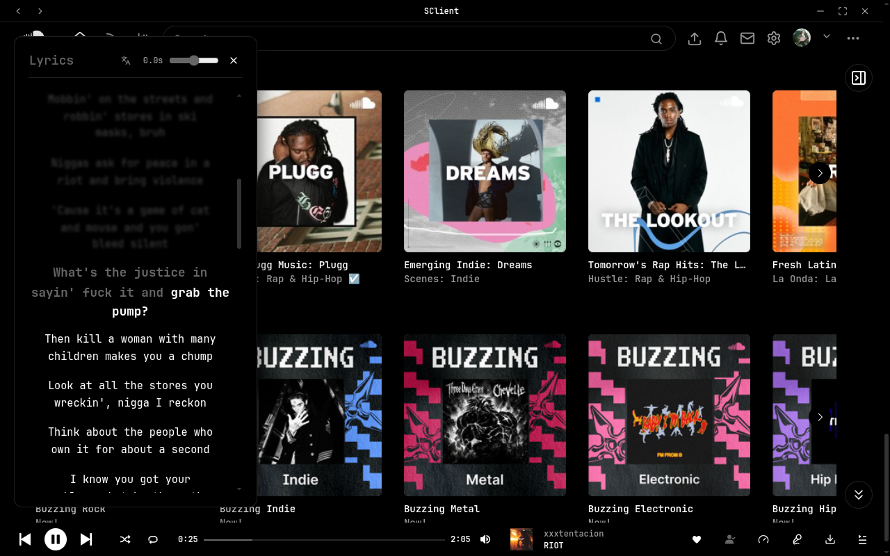
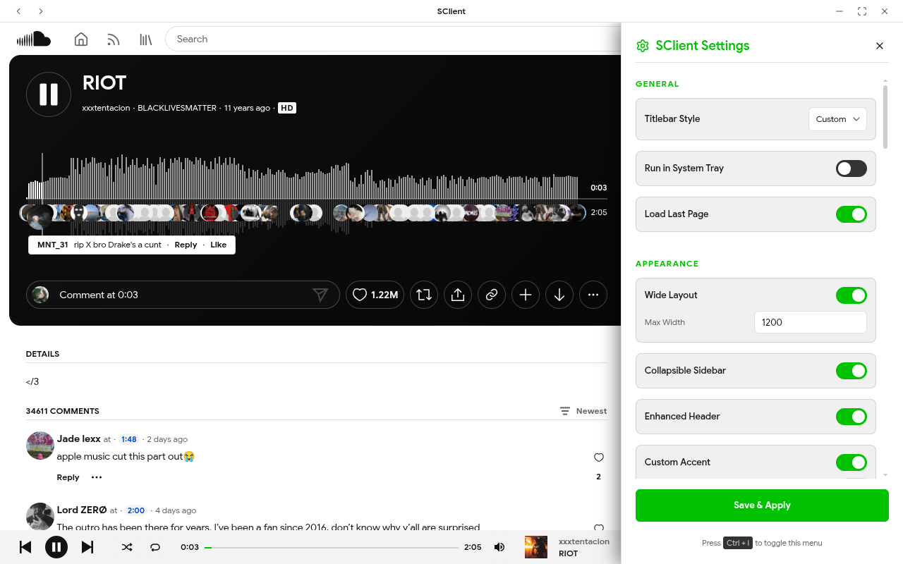
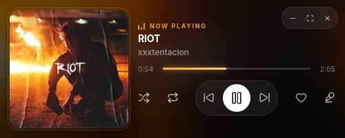
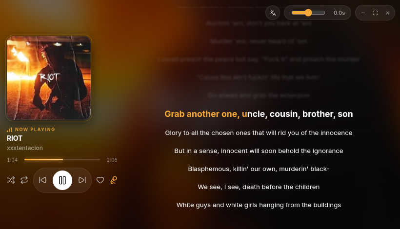

# SClient

Customizable cross-platform desktop client for SoundCloud

<p align="center">
  
  
</p>

<p align="center">
  
  
</p>

## Features

- Zero data/telemetry collection (from SClient itself) + Native Adblocker (Ghostery)
- Support for DRM-protected tracks using proper Widevine DRM (Castlabs Electron)
- Built-in proxy support for bypassing geoblocking (public proxy in-app via Vercel, or self-host `src/api/index.js`)
- Real-time speed/pitch shifting and reverb, as well as true shuffle (kinda broken honestly)
- Synced romanized lyrics (lrcmux.dev) and a floating mini-player with audio visualizer
- Last.fm/ListenBrainz scrobbling (with encrypted storage for keys)
- Discord Rich Presence
- Track/playlist downloader (youtube-dl)
- Custom CSS/JS editor, layout/theme customization, multi-account manager, and tray support
- Playlist manager overlay for imports/exports/etc. (also supports `.csv`'s from Exportify with fuzzy matching)
- Local listening history and analytics

## Installation

You can download SClient for Linux and Windows from the [Releases](https://github.com/vzpyr/sclient/releases).

## Build

You need Node.js.

```bash
git clone https://github.com/vzpyr/sclient.git
cd sclient
npm install
npm run build:linux
# or npm run build:win
```

Binaries will afterwards land in `dist/`.

### DRM on Windows

For DRM handling to work on Windows, SClient requires a certain signature on the executable. Before building, setup an Castlabs EVS account.

```bash
python3 -m pip install castlabs-evs
python3 -m castlabs_evs.account signup
npm run vmp:sign
# re-run the sign command if you ever update electron
```

## Usage

Press `Ctrl + I` or click the gear icon in the header to open settings

## License

[MIT](LICENSE)
